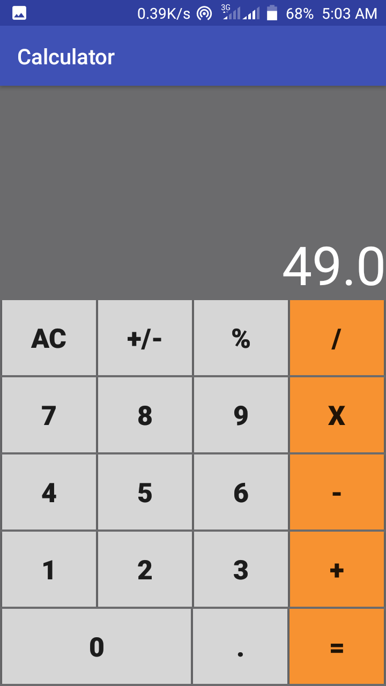

 # Calculator
 

     

This is a simple calculator designed using kotlin. It's a 
beginner level project. One of my beginner class project
in Android App development using Kotlin.

## Table of Contents
* [Setup](#setup)
* [License](#license)
### Setup
* Install [Android studio](https://developer.android.com/studio)
* Install [Android Development Tools](https://docs.oracle.com/en/middleware/developer-tools/jet/tutorials/jetma/index.html)
#### Gradle 
    gradle-4.4-all.zip
#### dependecies 
    implementation"org.jetbrains.kotlin:kotlin-stdlib-jdk7:$kotlin_version"
    implementation 'com.android.support:appcompat-v7:27.1.1'
    implementation 'com.android.support.constraint:constraint-layout:1.1.3'
### License
This project is licensed under [MIT License](./LICENSE) terms 
